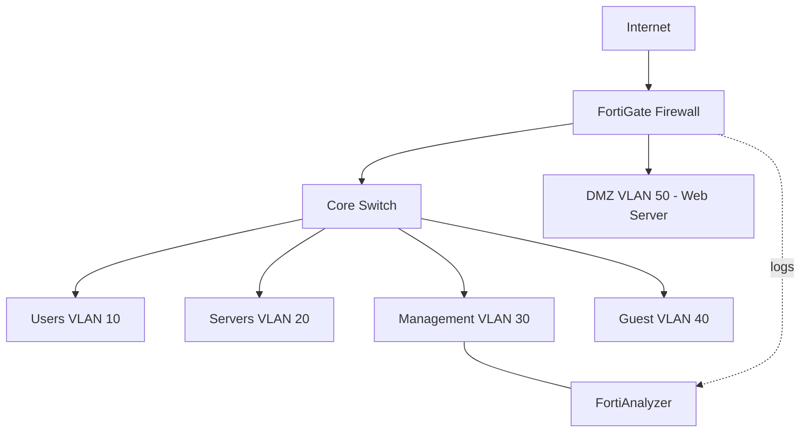

# Enterprise Network Security Architecture

```mermaid
flowchart TD
  INET[Internet] --> FW[FortiGate Firewall]
  FW --> CORE[Core Switch]
  FW --> DMZ[DMZ VLAN 50 - Web Server]
  CORE --> U[Users VLAN 10]
  CORE --> S[Servers VLAN 20]
  CORE --> M[Management VLAN 30]
  CORE --> G[Guest VLAN 40]
  FW -. logs .-> FAZ[FortiAnalyzer]
  M --- FAZ
```

Render: GitHub displays this automatically. To export an image, paste the block into https://mermaid.live.
