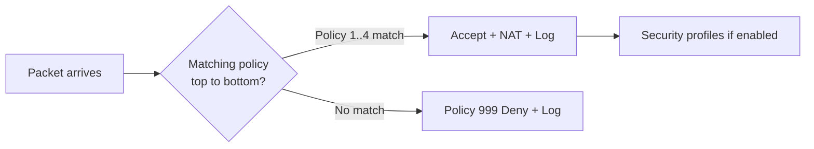

# Firewall Policy Evaluation Flow

```mermaid
flowchart LR
  P[Packet arrives] --> R{Matching policy<br/>top to bottom?}
  R -- Policy 1..4 match --> A[Accept + NAT + Log]
  R -- No match --> D[Policy 999 Deny + Log]
  A --> UTM[Security profiles if enabled]
```
