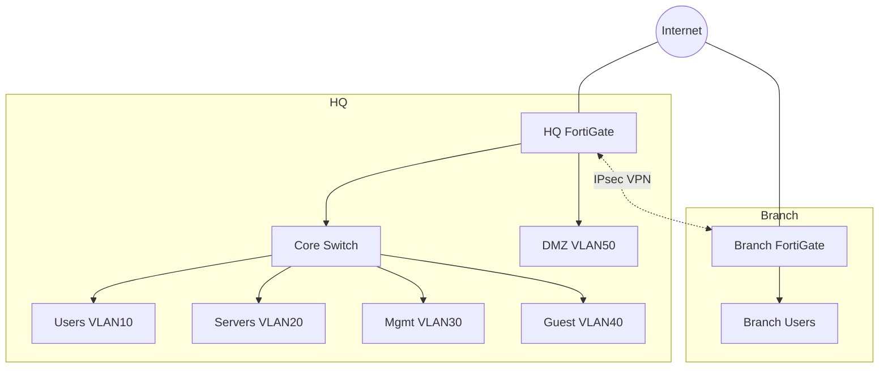

# Logical Topology: Multi-Site

```mermaid
flowchart TD
  subgraph HQ
    FW1[HQ FortiGate] --> CORE[Core Switch]
    CORE --> VU[Users VLAN10]
    CORE --> VS[Servers VLAN20]
    CORE --> VM[Mgmt VLAN30]
    CORE --> VG[Guest VLAN40]
    FW1 --> DMZ[DMZ VLAN50]
  end
  subgraph Branch
    FW2[Branch FortiGate] --> BU[Branch Users]
  end
  INET((Internet)) --- FW1
  INET --- FW2
  FW1 <-. IPsec VPN .-> FW2
```
