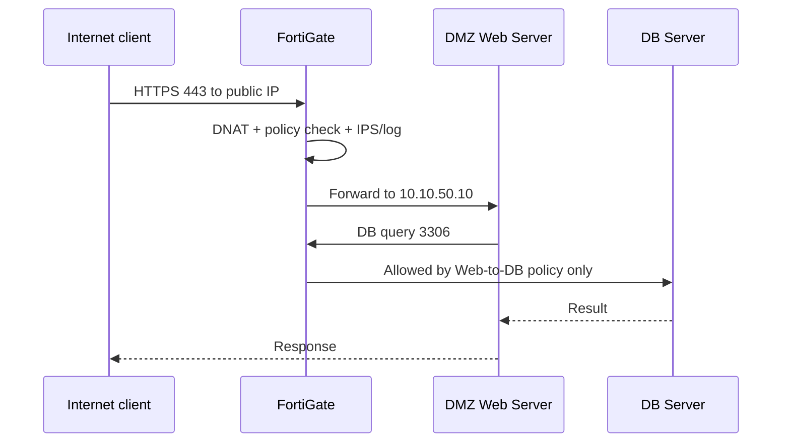

# Traffic Flow: Public Web Request

```mermaid
sequenceDiagram
  participant C as Internet client
  participant F as FortiGate
  participant W as DMZ Web Server
  participant DB as DB Server
  C->>F: HTTPS 443 to public IP
  F->>F: DNAT + policy check + IPS/log
  F->>W: Forward to 10.10.50.10
  W->>F: DB query 3306
  F->>DB: Allowed by Web-to-DB policy only
  DB-->>W: Result
  W-->>C: Response
```
