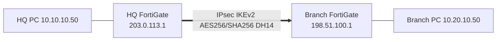

# Site-to-Site VPN Topology

```mermaid
flowchart LR
  PC1[HQ PC 10.10.10.50] --- FW1[HQ FortiGate<br/>203.0.113.1]
  FW1 == IPsec IKEv2 AES256/SHA256 DH14 ==> FW2[Branch FortiGate<br/>198.51.100.1]
  FW2 --- PC2[Branch PC 10.20.10.50]
```
