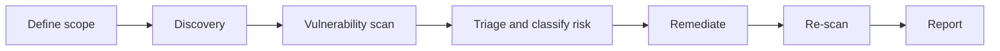

# Vulnerability Assessment Workflow

```mermaid
flowchart LR
  A[Define scope] --> B[Discovery]
  B --> C[Vulnerability scan]
  C --> D[Triage and classify risk]
  D --> E[Remediate]
  E --> F[Re-scan]
  F --> G[Report]
```
