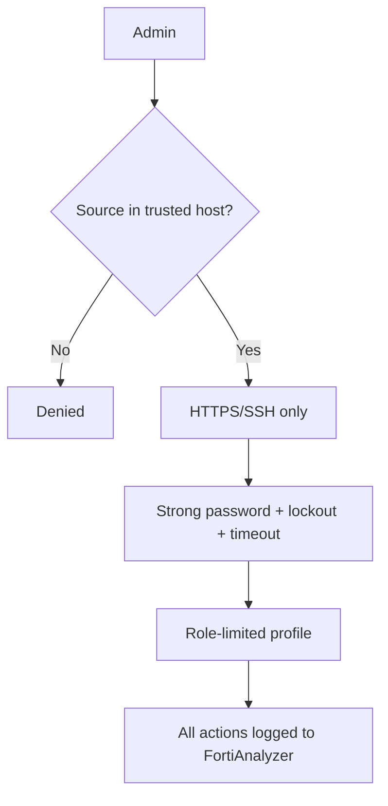

# Device Hardening Layers

```mermaid
flowchart TD
  A[Admin] --> B{Source in trusted host?}
  B -- No --> X[Denied]
  B -- Yes --> C[HTTPS/SSH only]
  C --> D[Strong password + lockout + timeout]
  D --> E[Role-limited profile]
  E --> F[All actions logged to FortiAnalyzer]
```
