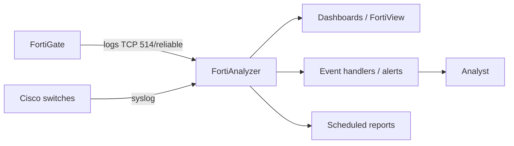

# Logging and Monitoring Architecture

```mermaid
flowchart LR
  FG[FortiGate] -- logs TCP 514/reliable --> FAZ[FortiAnalyzer]
  SW[Cisco switches] -- syslog --> FAZ
  FAZ --> D[Dashboards / FortiView]
  FAZ --> A[Event handlers / alerts]
  FAZ --> R[Scheduled reports]
  A --> SOC[Analyst]
```
