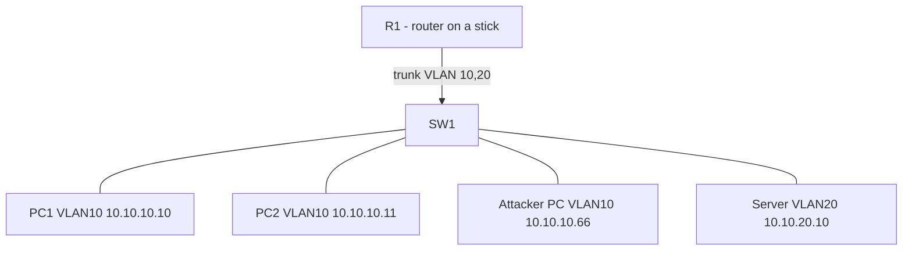

# Cisco Lab Topology

```mermaid
flowchart TD
  R1[R1 - router on a stick] -- trunk VLAN 10,20 --> SW1[SW1]
  SW1 --- PC1[PC1 VLAN10 10.10.10.10]
  SW1 --- PC2[PC2 VLAN10 10.10.10.11]
  SW1 --- ATK[Attacker PC VLAN10 10.10.10.66]
  SW1 --- SRV[Server VLAN20 10.10.20.10]
```
